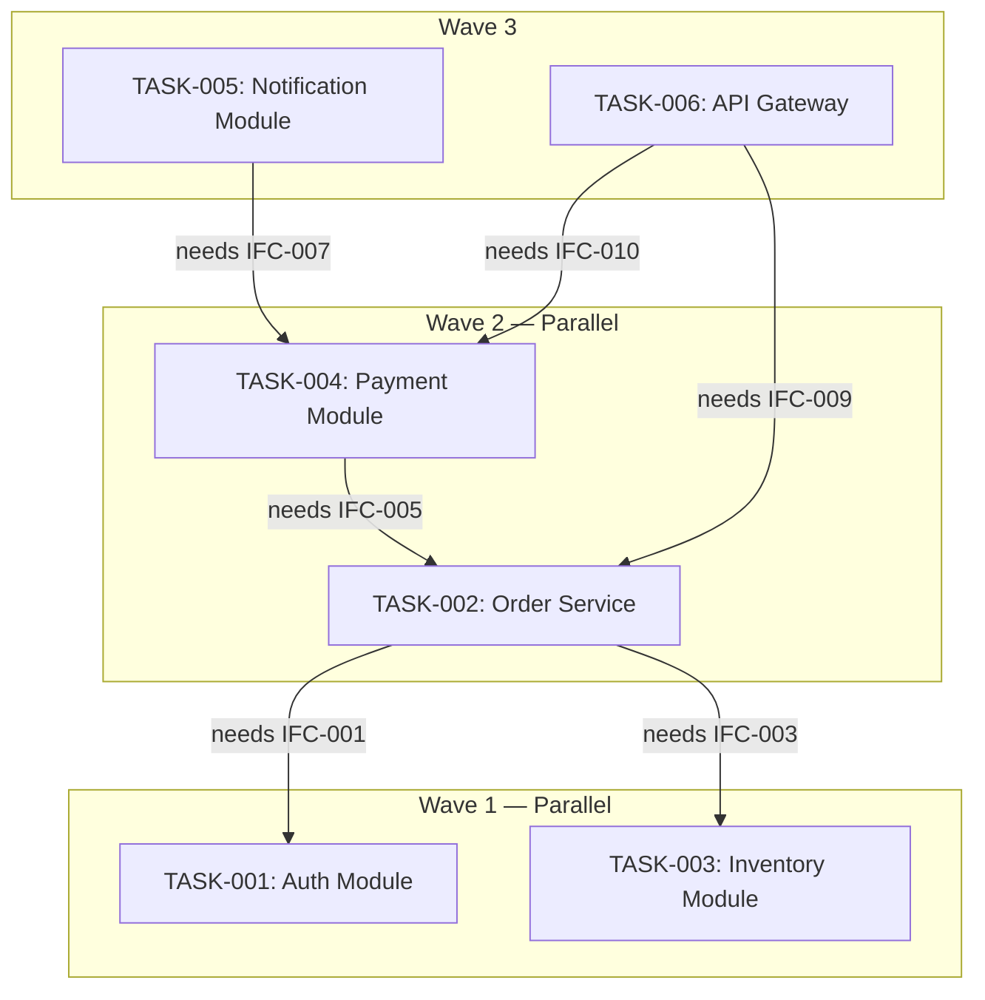

# Dependency Graphs Reference

The methodology for building dependency graphs (DAGs) for task manifests. This is Task 7 of the task engineering process.

## Why Dependency Graphs Matter

The harness uses the dependency graph to determine execution order and parallelism. Without a correct DAG:
- Tasks with sequential dependencies run in parallel → one task hallucinates the other's output.
- Tasks that could run in parallel run sequentially → wasted wall-clock time.
- Circular dependencies → deadlock, no tasks can start.

A correct DAG maximizes parallelism while guaranteeing every task has its dependencies met before it starts.

## Dependency Types

### Hard Dependencies (Blocking)

Task B cannot start until Task A completes. The dependency arises from:

| Dependency Type | Example | Detection |
|----------------|---------|-----------|
| Interface implementation | Task B calls an interface Task A produces | Task B's consuming interface contracts include one Task A implements |
| File creation | Task B modifies a file Task A creates | Task B's inclusion scope references a file in Task A's output contract |
| Data model dependency | Task B uses a data structure Task A defines | Task B's context references a type defined in Task A's output contract |
| Shared resource | Both tasks modify the same file | Scope conflict detected in Task 3 |

### Soft Dependencies (Ordering)

Task B should run after Task A but can technically start without it. This usually means Task B can make assumptions that Task A validates:

- Task A defines a convention; Task B should follow it but can proceed with a reasonable default.

For DAG purposes, treat soft dependencies as hard dependencies to avoid integration issues.

## Building the DAG

### Step 1: Extract Dependencies

For each task, identify all dependencies by cross-referencing:

1. **Interface contracts:** Task B's "Consumes" interfaces → which task "Implements" those interfaces?
2. **Scope (Task 3):** Task B's inclusion scope → which task's output contract creates those files?
3. **Data models:** Task B's context references types → which task's output contract defines those types?

Record as: `TASK-B depends on [TASK-A, TASK-C]`

### Step 2: Identify Parallel Waves

Group tasks into waves where no task in a wave depends on another task in the same wave:

- **Wave 1:** All tasks with zero dependencies (can start immediately).
- **Wave 2:** All tasks whose dependencies are entirely in Wave 1.
- **Wave N:** All tasks whose dependencies are entirely in Waves 1..N-1.

If a task depends on tasks in multiple waves, it goes in the wave after the latest wave of its dependencies.

### Step 3: Cycle Detection

A cycle exists if following the dependency edges leads back to the starting task. Cycles mean tasks have circular dependencies — neither can start.

**Detection method:** Topological sort. If the sort fails (not all nodes can be ordered), a cycle exists.

**Resolution:** Return to Task 2 and re-decompose the cyclic tasks. Common cause: two modules that both implement interfaces the other consumes. Re-decompose so that one provides and the other consumes, not both.

### Step 4: Document the DAG

Produce a Mermaid diagram showing all tasks, their dependencies, and parallel waves. See `templates/dependency-dag.md` for the format.

## Mermaid DAG Syntax

Use `graph TD` (top-down) for task dependency diagrams:

### Edge Label Convention

Label edges with the dependency reason:
- `-->|needs IFC-NNN|` — interface contract dependency
- `-->|creates file|` — file creation dependency
- `-->|defines type|` — data model dependency

### Wave Grouping

Use `subgraph` to group tasks by wave. This makes the parallelism visible at a glance and helps the harness identify which tasks to dispatch simultaneously.

## DAG Validation Checklist

- [ ] Every task appears as a node in the diagram
- [ ] Every dependency edge has a label explaining the dependency type
- [ ] No cycles exist (topological sort succeeds)
- [ ] Tasks are grouped into waves by parallelism
- [ ] Every task in Wave N has all its dependencies in Waves 1..N-1
- [ ] No task depends on a task in a later wave
- [ ] Tasks with zero dependencies are in Wave 1

## Anti-Patterns

### The Missing Edge
Task B depends on Task A's interface, but the edge isn't in the DAG. The harness dispatches B in parallel with A, and B hallucinates the interface. Detection: cross-reference every "Consumes" interface with the "Implements" task.

### The False Parallel
Two tasks are in the same wave but one actually depends on the other. Detection: check every pair of tasks in the same wave — if any pair has a dependency, they're not truly parallel.

### The Over-Sequential Graph
Every task is in its own wave (fully sequential), even though some could run in parallel. This wastes wall-clock time. Look for tasks with no dependencies on each other and move them to the same wave.
