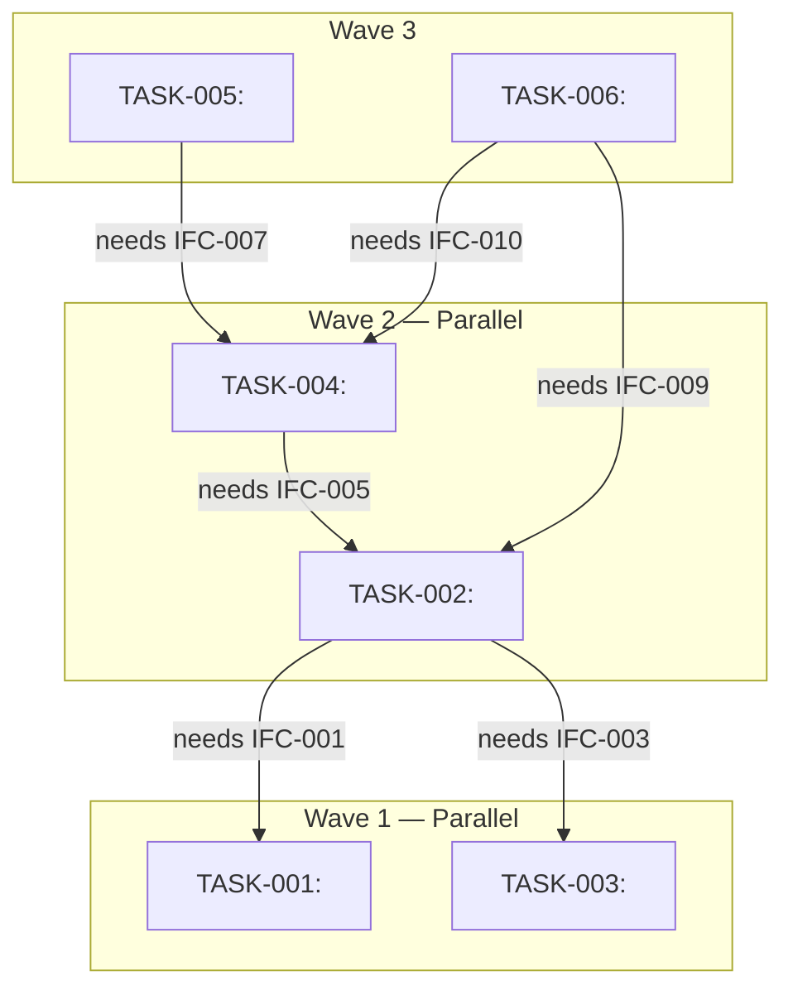

# Dependency DAG Template

> The dependency DAG shows task execution order and parallelism.
> Produced in Task 7. The harness uses this to dispatch tasks in waves.

---

## Dependency DAG

### Mermaid Diagram



### Dependency Table

| Task | Depends On | Blocks | Dependency Type | Reason |
|------|-----------|--------|----------------|--------|
| TASK-001 | — | TASK-002 | — | Foundation (no deps) |
| TASK-002 | TASK-001, TASK-003 | TASK-004, TASK-006 | Interface | Needs IFC-001, IFC-003 |
| TASK-003 | — | TASK-002 | — | Foundation (no deps) |
| TASK-004 | TASK-002 | TASK-005, TASK-006 | Interface | Needs IFC-005 |
| TASK-005 | TASK-004 | — | Interface | Needs IFC-007 |
| TASK-006 | TASK-002, TASK-004 | — | Interface | Needs IFC-009, IFC-010 |

### Wave Summary

| Wave | Tasks | Can Start When |
|------|-------|---------------|
| 1 | TASK-001, TASK-003 | Immediately |
| 2 | TASK-002, TASK-004 | Wave 1 complete |
| 3 | TASK-005, TASK-006 | Wave 2 complete |

### Cycle Check

- Topological sort: <pass / fail>
- If fail, cycle detected between: <TASK-IDs>
- Resolution: <return to Task 2 and re-decompose>

### Critical Path

The longest dependency chain determines the minimum wall-clock time:

```text
TASK-001 → TASK-002 → TASK-004 → TASK-006
```

Critical path length: <N> waves. Total parallelizable tasks: <M> of <total> tasks.
