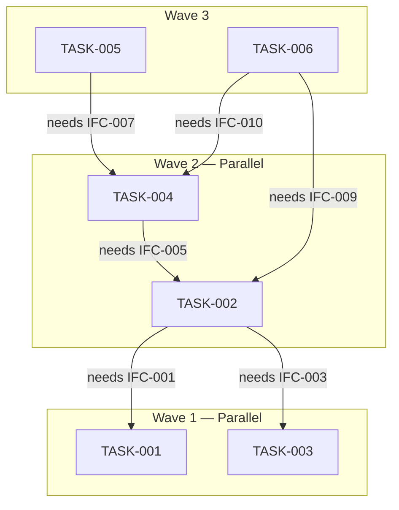

# Task Manifest Template

> The task manifest is the dispatchable artifact consumed by the coding harness.
> It must be self-contained — the harness dispatches each task entry as-is to an LLM.
> Use this template as the top-level document. Each task entry uses `task-entry.md`.

---

# Task Manifest

## Metadata

| Field | Value |
|-------|-------|
| Manifest version | 0.1.0 |
| Date | <date> |
| Architecture version | <version from architecture document> |
| SRS version | <version from SRS> |
| Target LLM | <model name, e.g., Claude Sonnet 4.5> |
| Context window | <e.g., 200K tokens> |
| Input context budget (40%) | <e.g., 80K tokens> |
| Total context budget (60%) | <e.g., 120K tokens> |
| Total tasks | <N> |
| Parallel waves | <M> |

## Module-to-Task Map

| Module | Tasks | Complexity |
|--------|-------|------------|
| Auth Module | TASK-001 | Simple |
| Order Service | TASK-002 | Moderate |
| Inventory Module | TASK-003 | Simple |
| Payment Module | TASK-004, TASK-004a, TASK-004b | Complex (decomposed) |
| Notification Module | TASK-005 | Simple |
| API Gateway | TASK-006 | Moderate |

## Dependency DAG

## Task Entries

<For each task, include the full task entry here. See `task-entry.md` for the per-task format.>

---

## Task TASK-001: <Title>

<Full task entry content — see task-entry.md template>

---

## Task TASK-002: <Title>

<Full task entry content>

---

<!-- Repeat for all tasks -->

## Self-Containment Audit Results

| Task | Self-Contained? | Notes |
|------|----------------|-------|
| TASK-001 | ✅ | All context included; no forward references |
| TASK-002 | ✅ | Interface contracts included in full |
| TASK-003 | ❌ | References "see architecture doc §4.2" — must inline |

## Feedback Artifacts

### To Architect

<If any modules couldn't decompose into single-context-window tasks, document the feedback here>

| Module | Issue | Suggested Action |
|--------|-------|----------------|
| Payment Module | Estimated 180K tokens — exceeds 60% budget | Split into payment-gateway and payment-logic sub-modules |

### To Requirements Engineer

<If any acceptance criteria couldn't be mapped cleanly, document the feedback here>

| Requirement ID | Issue | Suggested Action |
|----------------|-------|----------------|
| FR-012 | Not atomic — combines validation and processing | Split into FR-012a (validation) and FR-012b (processing) |
