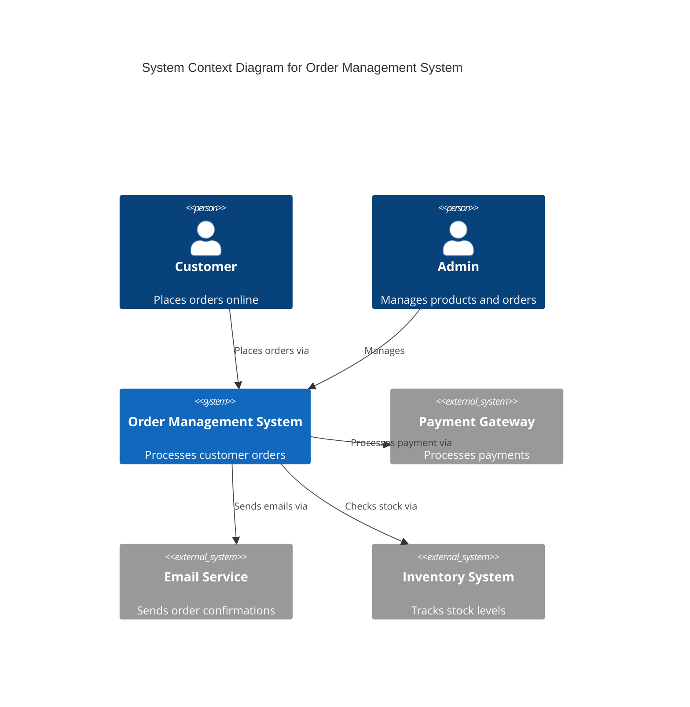
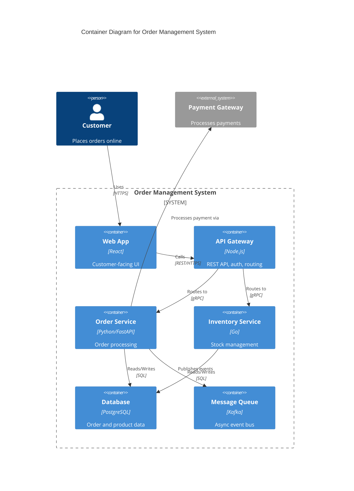
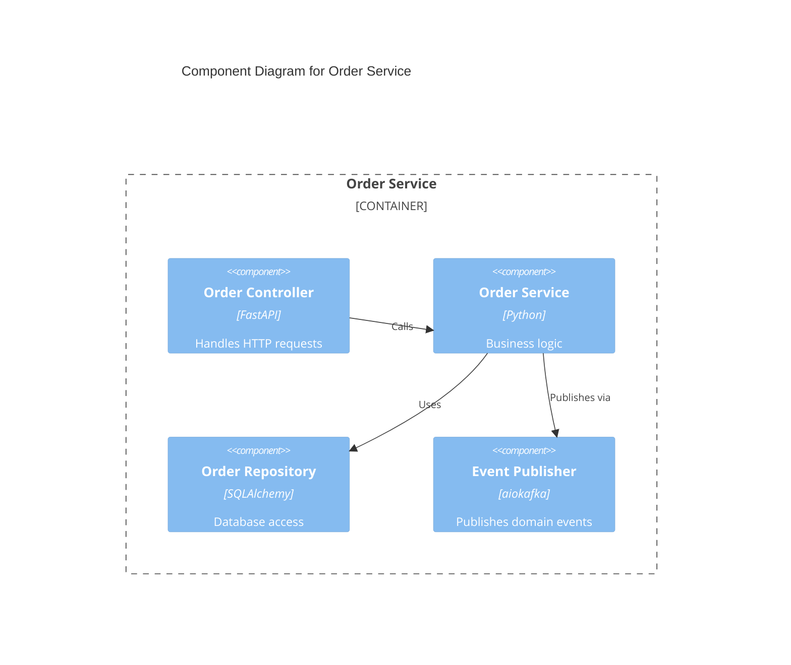
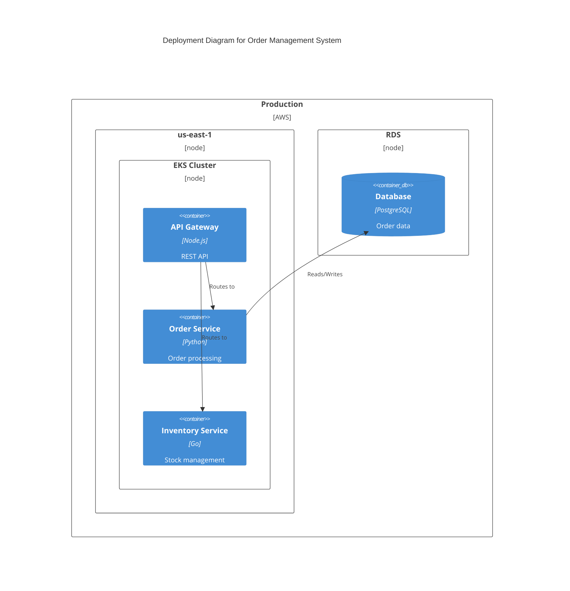
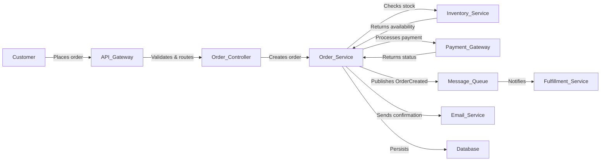

# C4 Diagramming Reference

Text-based architecture diagrams using Mermaid's C4 model support. The C4 model (by Simon Brown) describes software at four zoom levels — each diagram answers one question at one altitude.

## Why Text-Based

LLMs consume and reason about text, not images. Mermaid C4 diagrams are:
- **Version-controllable** — diffs show what changed
- **Readable as text** — LLMs can parse the structure
- **Renderable in Markdown** — any Markdown viewer shows the diagram

## C4 Levels

| Level | Question | Mermaid Keyword | When to Use |
|-----|-----|-----|-----|
| 1. Context | What is the system and who uses it? | `C4Context` | Stakeholder overview, system boundaries |
| 2. Container | What are the deployable pieces? | `C4Container` | Developer overview, technology stack |
| 3. Component | What's inside each container? | `C4Component` | Internal module structure |
| 4. Code | Class-level detail | (use class diagrams) | Rarely needed; use UML class diagrams |

## Context Diagram (Level 1)

**Key elements:**
- `Person(id, "Label", "Description")` — human actor
- `Person_Ext` — external human
- `System(id, "Label", "Description")` — your system
- `System_Ext(id, "Label", "Description")` — external system
- `Rel(from, to, "Label")` — relationship
- `Rel(from, to, "Label", "Technology")` — with technology annotation

## Container Diagram (Level 2)

**Key elements:**
- `Container(id, "Label", "Tech", "Description")` — deployable piece
- `Container_Ext` — external deployable
- `Container_Boundary` — groups containers in a system
- The **Tech** parameter (3rd) shows the technology from Task 5

## Component Diagram (Level 3)

**Key elements:**
- `Component(id, "Label", "Tech", "Description")` — module within a container

## Deployment Diagram

**Key elements:**
- `Deployment_Node(id, "Label", "Environment")` — infrastructure node
- `ContainerDb` — database container
- `ContainerQueue` — message queue container

## Data Flow Diagram

Use a standard Mermaid flowchart for data flow (C4 doesn't have a dedicated DFD type):

## C4 Best Practices

1. **Stay at one level per diagram.** A context diagram with containers crammed in is unreadable. One altitude per diagram.
2. **Order matters for layout.** Mermaid C4 doesn't have smart auto-layout. If the diagram looks wrong, reorder element declarations.
3. **Keep it simple.** Don't cram a 50-microservice system into one diagram. Break into multiple focused diagrams per subsystem.
4. **Annotate with technology.** The `Tech` parameter in `Container` and `Component` is where Task 5's technology decisions show up.
5. **Use `System_Ext` for external dependencies.** This makes system boundaries explicit — critical for the interface contracts in Task 4.
6. **Every module from Task 3 must appear.** The container/component diagrams are the visual proof that the decomposition is complete.

## Rendering

Mermaid diagrams render natively in:
- GitHub Markdown (push to a repo)
- VS Code with Mermaid extension
- Mermaid Live Editor (https://mermaid.live)
- Hermes desktop preview pane (open the `.md` file)

For PlantUML as an alternative, see the PlantUML component diagram syntax — it supports a similar level-based approach but requires a PlantUML server or local binary to render.
